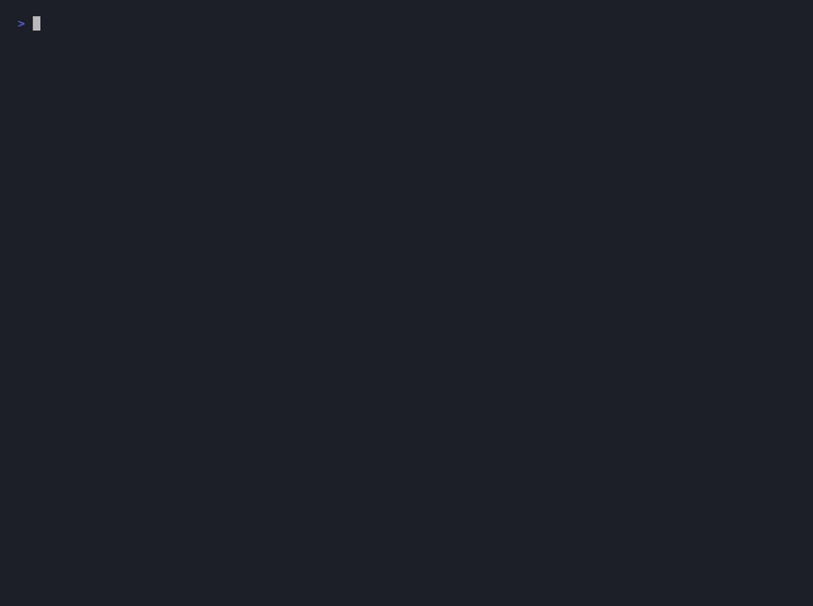

# Fonte — RAG documental com citação de fonte

Pergunte aos seus documentos e receba a resposta com **arquivo e página**.
Produto da Donadão Labs. Guardrails, tracing e avaliação medida.

> A pergunta entra → guardrail → busca vetorial (pgvector) → o modelo responde
> ancorado nos trechos → validação → resposta **com a fonte apontada**.

## Demo



Pergunta respondida **com citação de arquivo e página** → **"Não encontrei"** para
pergunta fora do corpus → **prompt injection barrado** pelo guardrail → métricas e
observabilidade. Reproduza com `make demo`.

## Arquitetura

```
pergunta → guardrail (in) → retriever (pgvector) → LLM (temp 0) → guardrail (out) → resposta com fonte
                                                      ↑                    ↑
                                                 contexto isolado     grounding check
                                     (tudo instrumentado no Langfuse: latência, tokens, custo)
```

## Stack

Python · FastAPI · LangChain · pgvector (Supabase) · OpenAI (embeddings) · Anthropic (geração) · Langfuse · RAGAS · Docker

## Decisões técnicas

- **chunk_size 1000 / overlap 200, em CARACTERES** (o `RecursiveCharacterTextSplitter` conta caractere, não token). Em português isso dá perto de 250 tokens, ou seja a faixa baixa do que se usa em produção: mais preciso na busca, com menos contexto por trecho. O overlap de 20% existe para a cláusula não ficar partida entre dois chunks, caso em que nenhum dos dois responde a pergunta.
- **temperature 0** — para RAG factual, criatividade é bug, não feature.
- **"Não encontrei" explícito** — dar ao modelo uma saída honesta é a defesa nº 1 contra alucinação.
- **Citação obrigatória (arquivo + página)** — resposta sem fonte é resposta que ninguém audita. É o produto.
- **`collection` parametrizada** — pronto para multi-tenant (v1.0): uma collection por cliente.

## Resultados (métricas RAGAS, golden set de 15 perguntas)

Corpus de exemplo: 3 documentos **fictícios** (um contrato, uma proposta e um termo de
entrega, em `sample_docs/`, gerados por `scripts/gen_sample_corpus.py`). Sem dados reais
de cliente.

**Leia os números com esta escala em mente:** o corpus indexado tem **9 chunks** e o
retriever usa **k=4**. Ou seja, cada pergunta recebe quase metade do acervo como contexto,
e é quase impossível o trecho certo ficar de fora. Os scores abaixo são reais, mas medem
um problema fácil. Num acervo de milhares de chunks, `context_recall` é a primeira métrica
que deve cair.

Rodada de **16/08/2026**:

| Métrica | Score | O que mede |
|---|---|---|
| faithfulness | **0.977** | alucinação (resposta fiel ao contexto) |
| answer_relevancy | **0.977** | vai direto ao ponto? |
| context_precision | **0.967** | retrieval trouxe lixo? |
| context_recall | **0.943** | retrieval esqueceu algo? |

**Os scores variam entre rodadas.** A rodada anterior, no mesmo corpus e com o mesmo
código, deu 0.983 / 0.967 / 0.957 / 0.940. O retrieval é determinístico; quem varia é o
LLM-juiz, mesmo com temperature 0. A leitura honesta desta tabela é **"faixa de 0.94 a
0.98"**, não o terceiro decimal. Duas perguntas concentram quase toda a perda, sempre as
mesmas: o objeto do contrato e o prazo de go-live, ambas com `context_recall` na casa de
0.55 a 0.60, que é o gap de retrieval já descrito abaixo.

**Método:** as quatro métricas são as do RAGAS, computadas com um LLM-juiz
(`claude-sonnet-4-6`, temperature 0) em `eval/run.py`. A lib RAGAS 0.4.3 tem conflito de
import com o LangChain 1.x deste stack (importa um caminho de `langchain-community` já
removido), então em vez de rebaixar o stack, as métricas foram implementadas diretamente —
mesma definição, sem a dependência frágil.

**Abstenção (o "Não encontrei"):** golden set mede o acerto quando a resposta existe; ele
não mede a recusa quando ela não existe, que é justamente a promessa central do produto.
Quem mede isso é `eval/abstention_set.json`: 6 perguntas plausíveis num acervo contratual
(rescisão, LGPD, confidencialidade, SLA de suporte, reajuste, contato do cliente) que
comprovadamente não têm resposta nestes três documentos. Roda junto no `make eval`, com
critério binário e verificável, sem LLM-juiz: a resposta contém a frase de recusa?

| | Resultado (16/08/2026) |
|---|---|
| **Taxa de recusa** | **6/6 = 1.000** |

O produto recusou as seis, sem inventar nenhuma cláusula. Mas leia com a escala certa:
**são 6 perguntas, não 600**, e num corpus de 9 chunks onde o que falta falta de forma
gritante. Um 1.000 aqui prova que a instrução de recusa funciona, não que ela seja
inquebrável. O teste difícil é a pergunta cuja resposta *quase* existe no acervo, e essa
ainda não está no conjunto.

**Leitura dos números:** as duas métricas de retrieval (`context_precision`/`recall`) são
as que primeiro cedem — coerente com o trade-off de `chunk_size` 1000 e `k=4`. Diagnóstico
útil: `faithfulness` alto com `context_recall` menor aponta para o **retrieval**, não para
a geração. Corpus pequeno e limpo puxa os números pra cima; num acervo maior espera-se mais
dispersão. Melhorias no roadmap: `k` maior e re-ranking.

## Observabilidade (Langfuse)

Cada pergunta vira um trace com latência, tokens e custo. Medido num lote de perguntas
sobre o corpus:

- **Custo por pergunta:** ~US$ 0,005 a 0,009 (embeddings + geração).
- **Latência por pergunta:** ~3,3 a 7,5 s.
- **Onde o tempo/custo mora:** na **geração** (LLM). O retrieval é uma única query vetorial
  no pgvector, de sub-segundo — quem pesa é o modelo. É esse o número que vira insumo de
  pricing no v1.0 (preço por pergunta).

## Limitações conhecidas

- Blocklist de guardrail é a camada fraca; burlável por paráfrase (a defesa real é contexto isolado + temp 0 + "Não encontrei").
- Sem re-ranking; `k` fixo em 4 — o `context_recall` é a métrica que primeiro cede.
- Golden set pequeno (15 perguntas) e corpus de exemplo enxuto (3 documentos, 9 chunks). Com `k=4`, o retriever entrega quase metade do acervo por pergunta, o que puxa os scores para cima.
- Taxa de abstenção medida (6/6) sobre apenas **6 perguntas**, todas com ausência óbvia no acervo. Falta o caso difícil: a pergunta cuja resposta quase existe, que é onde a recusa costuma quebrar.
- Scores do golden set **variam entre rodadas** (faixa de 0.94 a 0.98 nas duas medidas até aqui), porque o juiz é um LLM. Um número isolado com três decimais dá falsa precisão.
- Sem índice vetorial: a coluna criada pelo `langchain-postgres` é `vector` sem dimensão declarada, e o pgvector recusa indexar (`column does not have dimensions`). No volume atual o scan exato resolve; indexar exige antes um `ALTER TABLE ... TYPE vector(1536)`.
- Citação em texto livre: o contexto entra rotulado com `[arquivo p.N]` vindo do metadado, mas o código não valida que o arquivo e a página citados estão entre os chunks recuperados. O desenho robusto é o modelo referenciar id de chunk e o código traduzir para arquivo e página.
- Sem threshold de similaridade: `k` é fixo, então o retriever sempre devolve 4 trechos, mesmo irrelevantes. A abstenção depende só da instrução no prompt.
- Avaliação por LLM-juiz (não pela lib RAGAS, por conflito de versão) — juiz e gerador são o mesmo modelo, o que pode inflar levemente as notas.
- Single-tenant nesta versão (multi-tenant no roadmap v1.0).

## Roadmap

- **v0.1 (atual):** single-tenant, corpus Donadão Labs.
- **v1.0:** multi-tenant, upload por cliente, isolamento por collection, painel Next.js, LGPD.

## Rodar local

Atalhos via `make` (rode `make help` para a lista). Tudo roda na `.venv`.

```bash
# 1. ambiente
make install                       # cria .venv + instala deps

# 2. chaves
cp .env.example .env               # e preencha OPENAI/ANTHROPIC/DATABASE_URL/LANGFUSE

# 3. Supabase (SQL Editor): create extension if not exists vector;

# 4. corpus → coloque os PDFs em docs/ e ingira
make ingest                        # Fase 1

# 5. suba a API
make dev                           # uvicorn com reload em :8000
#    GET  /health   → {"status":"ok"}
#    POST /ask      → {"question": "qual o prazo de pagamento?"}

# 6. avaliação
make eval                          # Fase 6 (RAGAS sobre o golden set)
```

### Docker

```bash
docker build -t fonte-rag .
docker run --env-file .env -p 8000:8000 fonte-rag
```

---

Built by Donadão Labs.
